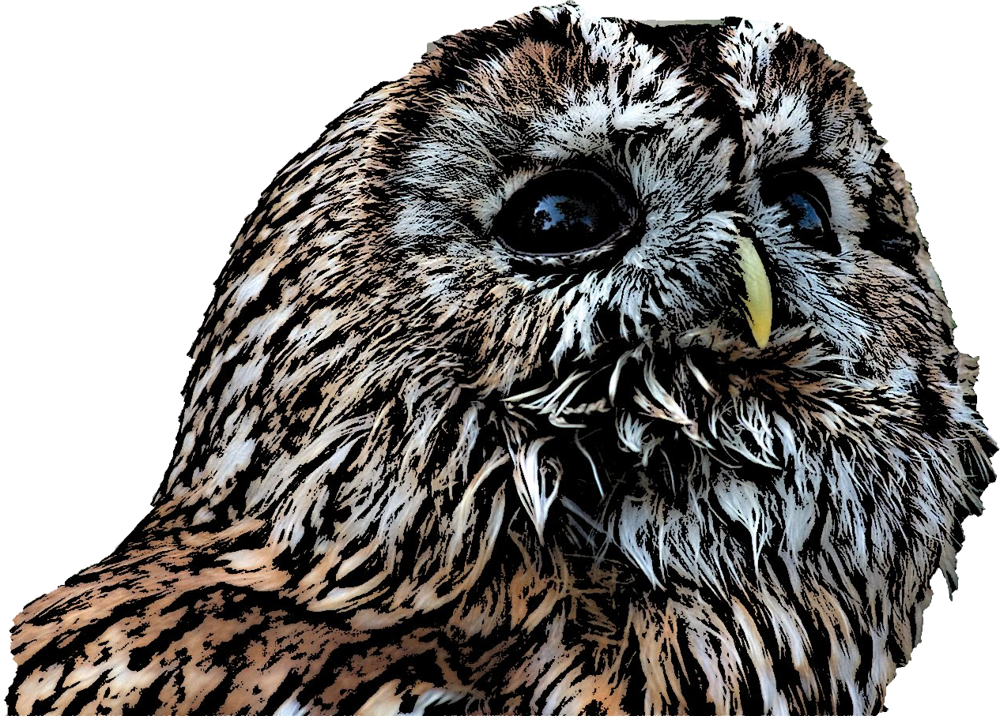

Tawny-OWL
===========

## Introduction

Tawny-OWL allows construction of OWL ontologies, in a evaluative, functional
and fully programmatic environment. Think of it as the ontology engineering
equivalent of [R](http://www.r-project.org/). It has many advantages over
traditional ontology engineering tools, also described in a
[video introduction](https://vimeo.com/89782389).

- An interactive shell or REPL to explore and create ontologies.
- Source code, with comments, editable using any of a range of IDEs.
- Fully extensible -- new syntaxes, new data sources can be added by users
- Patterns can be created for individual ontologies; related classes can be
  built easily, accurately and maintainably.
- A unit test framework with fully reasoning.
- A clean syntax for versioning with any VCS, integrated with the IDE
- Support for packaging, dependency resolution and publication
- Enabled continuous integration with both ontology and software dependencies

Tawny-OWL is implemented as a domain-specific language but built over a full
programming language called [Clojure](http://www.clojure.org). Many of the
features described (REPL, patterns, unit tests, extensibility) derive directly
from the Clojure language, or from general-purpose programming tools (IDEs,
versioning, continuous integration). The core ontology features are
implemented directly using the [OWL API](http://owlapi.sourceforge.net/).
These features are, therefore, industry strength, standards-compliant and
well-supported independently of the Tawny-OWL developers.

OWL is a W3C standard ontology representation language; an ontology is a fully
computable set of statements, describing the things and their relationships.
They are used, mostly notable in biomedicine, to describe complex areas of
knowledge such as [genetics](http://www.geneontology.org/) or
[clinical terminology](http://en.wikipedia.org/wiki/SNOMED_CT), but can
describe anything, including [e-commerce](http://purl.org/goodrelations/). For
more tutorial information, please see http://ontogenesis.knowledgeblog.org.

A [full-length manual](https://phillord.github.io/take-wing/) is also
[available](http://github.com/phillord/take-wing). The original,
slightly older [getting started](docs/getting-started.md) document is
available.

## For the Clojure developer

Tawny-OWL is predominately designed as a programmatic application for ontology
development, but it can be used as an API. OWL ontologies are a set of
statements about things and their relationships; underneath these statements
map to a subset of first-order logic which makes it possible to answer 
questions about these statements using highly-optimised reasoners.

Currently, the use of ontologies as a tool within general-purpose programming
is relatively under-developed. Part of the intention behind Tawny-OWL is to
embed ontologies deeply within a programmatic framework, to see whether
ontologies are useful in this way.

Further information on the use of Tawny-OWL is available in the
[documentation](docs/tawny-as-an-api.md).

## Motivation

I discuss the development of this code base in my
[journal](http://www.russet.org.uk/blog). Two posts include one on the
[motivation](http://www.russet.org.uk/blog/2214) and another on making
the library more ["lispy"](http://www.russet.org.uk/blog/2254). All
revelevant posts are
[categorised](http://www.russet.org.uk/blog/category/all/professional/tech/tawny-owl).

## Installation

Tawny-OWL requires no installation *per se* and is used as any Clojure
library. It is available from
[clojars](https://clojars.org/uk.org.russet/tawny-owl), so just add:

`[uk.org.russet/tawny-owl]` to your `project.clj` file.

I use Leiningen 2 on the current version 16.04 Ubuntu and, occasionally, on
Windows. Editing of both tawny-owl and the ontologies using it, is with Emacs
25 using Clojure mode and nrepl, currently both installed from their
respective versioning systems. The library should not depend on this
environment, however.

## Author

Phillip Lord, Newcastle University.

http://www.russet.org.uk/blog

## Mailing List

There is a [mailing list](mailto:tawny-owl@googlegroups.com).

## Version

## License

The contents of this file are subject to the LGPL License, Version 3.0.

Copyright (C) 2012, 2013, Newcastle University

This program is free software: you can redistribute it and/or modify it under
the terms of the GNU Lesser General Public License as published by the Free
Software Foundation, either version 3 of the License, or (at your option) any
later version.

This program is distributed in the hope that it will be useful, but WITHOUT
ANY WARRANTY; without even the implied warranty of MERCHANTABILITY or FITNESS
FOR A PARTICULAR PURPOSE. See the GNU General Public License for more details.

You should have received a copy of the GNU Lesser General Public License along
with this program. If not, see http://www.gnu.org/licenses/.
